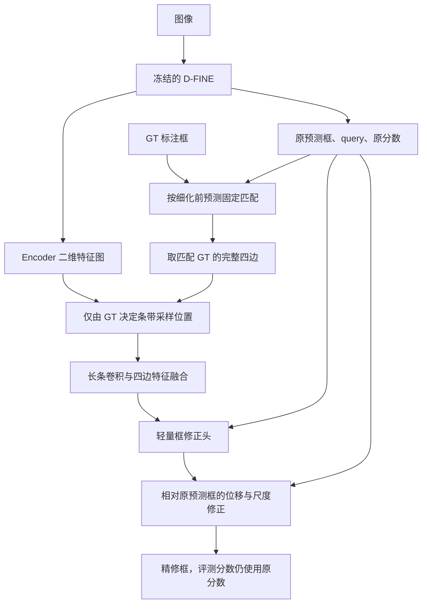

# D-FINE 边界条带特征细化：先做 GT 引导验证，再研究预测分布引导

日期：2026-09-21

状态：研究与实现设计；当前仅形成文档，模块与实验尚未实现。

本文承接[小目标精确定位总体方案](small_object_precise_localization_proposal.md)。研究顺序明确为：

> 先直接使用 GT 标注框决定条带采样位置，验证“在正确边界附近提取局部特征，能否帮助修正原预测框”。只有获得正面证据后，再使用 D-FINE 预测的边界分布指导取证，研究可部署的方法。

**第一阶段的新增模块不使用预测边界分布选择位置、生成候选、分配采样预算或加权特征。** 长条卷积读取的条带，其法向位置和沿边跨度都由 GT 框决定。

GT 指人工标注框，不等同于精确的物体可见轮廓。所有性能收益均待实验验证。

## 1. 研究顺序与当前范围

需要依次回答三个问题：

1. **GT 引导下是否可行？** 直接在 GT 四边附近读取 Encoder 特征，经过长条卷积和框修正头，能否改善原预测框的定位？
2. **首轮收益是否依赖新增视觉内容？** 在相同 GT 采样位置、模型结构、匹配集合和训练预算下，将新增采样特征替换为常量或随机空间特征，收益是否明显变化？
3. **预测分布能否提供有效引导？** 前两项取得正面证据后，再将采样引导换成模型预测的边界分布，验证正常推理时能否保留收益。

前两项属于同一轮 GT 可行性实验。第三项是后续阶段，**不是开展第一轮实验的前置条件**。

| 阶段 | 新增条带采样由谁决定 | 是否使用预测概率加权 | 主要任务 |
| --- | --- | --- | --- |
| 第一阶段：GT 可行性 | GT 四边位置及 GT 沿边跨度 | 不使用 | 验证正确位置的局部特征是否有利用价值 |
| 第二阶段：预测引导 | 模型预测框或分布对应的候选位置 | 在分布版本中使用 | 将 GT 取证能力转成无 GT 的检测能力 |
| 后续完善 | 已验证的预测引导方式 | 按最终结构确定 | 端到端训练、结构消融与计算优化 |

第一阶段是 GT 参与前向计算的 oracle 诊断实验，不能将其指标作为正常检测性能。该实验也不是严格的性能上界：即使取证位置正确，特征或修正网络仍可能无法利用这些信息。

## 2. 第一阶段的数据边界

### 2.1 原模型提供什么

固定一个已训练的 D-FINE checkpoint，冻结骨干、Encoder、Decoder、原预测头及其归一化层。原模型只向新增实验模块提供：

- Encoder 输出的二维特征图 \(F_l\)；
- 末层目标 query \(q\)；
- 已经解码的原预测框 \(\hat b\)；
- 原分类分数，用于匹配和固定分数的评测。

D-FINE 内部仍按原方式产生自己的预测框，但其边界 logits、bin 概率、候选支持值不作为首轮新增取证模块的输入。**保留一个待修正的原框，不等于使用预测分布指导卷积。**

### 2.2 GT 提供什么

对匹配到的 GT 框 \(b^{GT}\)，由它确定：

1. 四条边的法向坐标；
2. 每条边沿边方向的起止位置；
3. 内侧、边上、外侧三组采样点。

GT 坐标进入采样器，以及常规匹配与损失监督。GT 坐标、GT 与预测框的差值、GT 编码后的向量，不直接输入框修正头。

### 2.3 首轮不包含的模块

第一阶段不建立以下依赖：

- 不生成 D-FINE 的 33 个候选边界来采样；
- 不按预测概率或 GT 插值概率对候选特征加权；
- 不保留一个由预测候选位置取证的并行视觉分支；
- 不先训练预测引导模型，再临时将其输入换成 GT；
- 无匹配 GT 或 GT 采样失效时，不回退到预测分布采样。

这样首轮只检验一条明确路径：GT 定位条带 → 图像特征 → 卷积编码 → 框修正。

## 3. 第一阶段的最小结构

### 3.1 数据流



原分数只参与匹配与评测；修正头实际接收 query、原预测框几何和新增 GT 条带特征。

### 3.2 从 GT 四边采样

以 GT 右边界为例，设 GT 四边为 \((x_L^{GT},y_T^{GT},x_R^{GT},y_B^{GT})\)，则：

\[
T_R(s,n)=F_l\left(
x_R^{GT}+d_n,\;
y_T^{GT}+t_s(y_B^{GT}-y_T^{GT})
\right),
\]

其中 \(t_s\in[0,1]\)，\(d_n\in\{-\delta,0,+\delta\}\) 分别对应内侧、边上、外侧。

左边使用相反的内外方向，上、下边做相应方向变换。**右边的横坐标和纵向跨度均来自 GT，不使用原预测框来确定条带形状。**

每条边得到一个 \(C_b\times S\times3\) 条带；四边合计为 \(4\times C_b\times S\times3\)。这里没有候选 bin 维度，也没有任何预测概率权重。

实现步骤：

1. 从当前配置最高分辨率的 Encoder 输出开始，先用 \(1\times1\) 投影降到 \(C_b\) 通道。
2. 使用统一的输入图像坐标进行双线性采样，得到 GT 四边条带。
3. 将四边转换成“沿边方向 × 内外方向”的局部排列。
4. 用共享长条卷积编码，沿边聚合后保留内、边、外的有序特征。
5. 融合得到四条边各自的特征，再按左、上、右、下固定顺序交给修正头。

起始参数可取 \(C_b=64,S=5,m=3,\delta=1\) 个网络输入像素，长条卷积使用沿边方向的 \(m\times1\) 深度卷积与通道融合。这些是工程起点，需在验证集检查适用性。

\(\delta\) 用网络输入像素定义，再转换为特征层采样坐标。GT 必须经过与图像一致的缩放、裁剪和填充；输入尺寸、归一化方式与采样算子的坐标约定必须一致。

### 3.3 由 GT 条带特征预测框修正

记四边编码为 \(g_L,g_T,g_R,g_B\)，原预测框采用中心和宽高表示 \(\hat b=(\hat x,\hat y,\hat w,\hat h)\)。新增头预测四个无量纲修正量：

\[
(d_x,d_y,d_w,d_h)
=h\left(q,\operatorname{Embed}(\hat b),g_L,g_T,g_R,g_B\right).
\]

采用中心位移与宽高对数缩放：

\[
x'=\hat x+\hat w d_x,\qquad
y'=\hat y+\hat h d_y,
\]

\[
w'=\hat w\exp(\operatorname{clip}(d_w,-a,a)),\qquad
h'=\hat h\exp(\operatorname{clip}(d_h,-a,a)).
\]

\(a\) 是预先固定、各组一致的数值稳定范围；不根据 GT 误差为每个样本设置。尺度由原预测宽高决定，不使用 GT 宽高来缩放修正量。

对合法的正宽高原框，这种参数化保持精修框宽高为正，避免四条边自由移动造成交叉。最后一层零初始化时恢复原预测框。基线已有无效框的处理应预先统一并记录，不能只对某个实验改变裁剪或过滤规则。

首轮采用这个直接框修正头，是为了先判断新增 GT 边界特征能否被利用。它没有新的分布输出，也不受原候选支持范围的额外限制；**首轮有效不自动证明后续逐候选分布更新同样有效。**

### 3.4 训练目标

只训练新增通道投影、条带编码器、特征融合及框修正头，基线设为冻结评估状态；新增层正常训练。

训练损失使用精修框的 L1 与 GIoU，例如沿用现有框损失系数作为起点：

\[
\mathcal L
=\lambda_1\mathcal L_{L1}(b',b^{GT})
+\lambda_g\mathcal L_{GIoU}(b',b^{GT}).
\]

L1 的框格式沿用既定实现，GIoU 转为四边坐标计算。所有首轮对照使用相同系数和训练预算。

本阶段不为新增头计算 FGL 或分布蒸馏，因为它不输出新分布。固定原分类及 LQE 分数，用来隔离框坐标变化；以后做可部署模型时再研究评分与新框质量的一致性。

## 4. 第一阶段如何组织训练和评测

### 4.1 使用 GT 训练，也使用 GT 做诊断评测

首轮直接训练 GT 引导模块：

- 训练集：从 GT 框读取条带，训练新增修正头。
- 验证集：同样从 GT 框读取条带，用于开发与参数选择。
- 独立测试集：在事先规定的 GT 诊断协议下读取 GT 条带，评估泛化。

不要求先训练一个预测引导头，也不在第一阶段安排 GT/预测路由的交叉评测。没有独立测试集时，明确验证集兼作开发集的限制。

### 4.2 固定 query–GT 匹配

每张经图像变换后的输入先运行冻结基线，使用原框和原类别 logits，按现有 HungarianMatcher 的分类、L1 和 GIoU 成本配置得到一对一匹配。对相同输入，所有首轮对照使用同一份匹配。

- 只使用正常检测 query，不使用去噪 query。
- 不根据精修后的结果重新选择 query–GT 配对。
- 不把 GT 类别、GT 框或 GT 相对位移直接输入修正头。
- 被匹配不代表正确检出；低 IoU 的匹配也保留，并按原 IoU 分组分析。
- 空 GT、忽略标注及 GT 数量超过 query 数量的情况按既定规则处理并记录。

当前损失入口可能自行匹配并合并多层定位匹配。诊断实现应显式复用固定匹配及框损失公式，不能假定直接调用原 criterion 就满足这个协议。

### 4.3 未匹配 query 和采样失效

**首轮只修正有匹配 GT 且具备有效条带的 query；其余 query 保留原框和原分数。**

不为未匹配 query 构造预测条带，不调用预测概率，不删除其检测。GT 采样不足时同样保留原框，记录未修正比例。所有首轮对照使用相同的可修正集合。

这仍包含“哪些 query 可以修正”的 GT 选择信息，因此所有首轮全图指标都标为 oracle 指标。容量对照和常量/随机特征对照使用相同 GT 选择，避免把选择优势误认为边界特征收益。

### 4.4 输出与评测

- 保留全部正常 query 和原分数，使用相同后处理；不能根据 GT 删除假阳性、补框或改类别。
- 对固定配对集合，比较修正前后的边界像素误差、中心/宽高误差和 IoU。
- 同时报告未匹配 GT、未匹配预测和原框低 IoU 的情况。
- 记录图外采样、有效性标记和回退率；对照中保留相同有效性处理。
- 模块在 GT 正确位置取样，不等于把 GT 直接作为结果输出。

## 5. 首轮最小对照与判定

### 5.1 当前需要做的实验

以下实验都不使用预测边界分布指导条带采样：

| 编号 | 设置 | 条带位置来源 | 新增采样视觉内容 | 目的 |
| --- | --- | --- | --- | --- |
| G0 | 冻结原 D-FINE，不加修正 | 无新增条带 | 无 | 原始定位基准 |
| G1 | GT 条带 + 长条卷积 + 框修正头 | 完整 GT 四边 | 原 Encoder 特征 | 核心可行性实验 |
| G2 | 与 G1 同结构，采样视觉值在编码前置常量 | 与 G1 完全相同 | 常量 | 额外预测容量、GT 选择和非视觉路径的对照 |
| G3 | 与 G1 同结构，采样特征图换成随机空间特征图 | 与 G1 完全相同 | 与当前图像及 GT 无关的随机场 | 检查位置信息、采样跨度等是否足以解释收益 |

实际执行可先跑 G0、G1、G2；在把 G1 的提升归因于边界视觉内容前，补齐 G3。若需要更直接的容量比较，可再增加仅使用 query 与原框几何的修正头，并使用相同可修正集合。

G2、G3 独立训练，不仅是在 G1 测试时临时置零或换特征。保持基线 checkpoint、数据变换、新增结构、训练预算及随机种子安排一致。

### 5.2 常量与随机特征对照的含义

G2 仍计算 GT 采样位置和有效性，但将新增采样视觉值置为固定常量。query 中原有图像信息保持不变。若 G2 同样改善，说明额外修正容量或 GT 选择等因素也可能贡献收益。

G3 用同一张随机空间特征图生成同一图像的四条边特征，保持投影、采样、卷积和有效性逻辑一致：

- 随机场不依赖当前图像、GT、目标数量或类别，也不在 GT 附近设置特殊内容。
- 训练时每图、每次前向重新生成；评测记录随机种子并重复观察波动。
- 通道量级可以用训练集统计设定；可补充平滑随机场，以检查空间相关性的影响。
- 本阶段只有一条新增 GT 视觉路径，不存在“原预测候选特征 + GT 上下文”的双路径。

这些对照用于增强解释力，不保证完全消除 GT 采样产生的隐式位置或尺度信息。尤其 GT 条带范围、插值结构和有效性模式本身都由 GT 决定，必须结合对照分析。

### 5.3 指标和结果表

首轮至少报告：

- 固定原分数的全图 oracle AP@[.5:.95]、AP50、AP75；
- 按 GT 尺寸分组的 AP 和几何误差；
- 固定 query–GT 配对上的四边绝对像素误差、IoU 变化及提升/退化数量；
- 原 IoU < 0.50、0.50–0.75、≥ 0.75 的分组变化；
- 无效框、无效采样、未修正 query 和未匹配 GT 的数量；
- 新增参数、延迟与显存。

像素误差说明是原图还是网络输入坐标；所有实验的尺度变换与后处理一致。不得只展示成功从 IoU 0.50 提升到 0.75 的样本，也要记录原本正确但修正后退化的样本。

| 实验 | 固定分数 AP75 | 配对四边误差 | 配对 IoU 变化 | 提升/退化数量 | 备注 |
| --- | --- | --- | --- | --- | --- |
| G0 | 待测，正常基线 | 待测 | 基准 | 基准 | 原 D-FINE |
| G1 | 待测，oracle | 待测 | 待测 | 待测 | GT + 真实特征 |
| G2 | 待测，oracle | 待测 | 待测 | 待测 | GT + 常量特征 |
| G3 | 待测，oracle | 待测 | 待测 | 待测 | GT + 随机特征 |

### 5.4 什么结果值得进入第二阶段

| 观察 | 解释与下一步 |
| --- | --- |
| G1 稳定优于 G0，并且优于 G2/G3，配对定位误差也下降 | 支持当前 GT 边界取证可被利用，进入预测引导研究 |
| G1 优于 G0，但与 G2 接近 | 可能主要是额外修正容量或选择信息，尚不能归因于边界视觉内容 |
| G3 也有明显提升 | 检查 GT 位置、跨度及有效性提供的信息，收紧视觉内容归因 |
| G1 没有提升 | 当前分辨率、条带编码或修正头未体现收益，先检查这些环节，不急于加入预测分布 |
| 仅部分尺寸或误差区间改善 | 报告适用范围并检查负面区间，避免只展示有利子集 |

GT 居中的特征不直接告诉头“相对原预测框偏了多少”。因此，G1 无提升不能证明真实边界信息没有价值，也可能是当前表示缺少可用的相对定位线索。不能通过直接输入 GT 位移来补救，否则等于给出了答案。

## 6. 第二阶段：引入预测边界信息

**本节在第一阶段取得正面证据后再实施，不属于当前首轮实验。**

### 6.1 先控制引导方式变化

可以先建立与 G1 相同的卷积编码器和框修正头，仅将 GT 四边采样换成原预测框四边采样的单框对照。这个中间对照不要求使用概率分布，用于观察取证位置误差的影响。

预测引导模型应在预测引导下训练，再在无 GT 的条件下评测；训练损失仍可正常使用标注。不能仅将 GT 训练好的头在测试时突然切到预测位置，就判断预测引导无效。

正常部署评测需对全部正常 query 执行规定的预测引导策略，不使用 GT 来选择哪些 query 可修正。若做固定匹配子集的诊断比较，另外标为 oracle 选择诊断，不能与正常全图性能混用。

### 6.2 使用 D-FINE 分布引导多候选取证

后续完整版本再引入原边界 logits \(z_{j,k}\)、概率 \(p_{j,k}\) 与候选坐标：

\[
p_{j,k}=\operatorname{softmax}_k(z_{j,k}),\qquad
c_{j,k}=\mathcal D_j(b_0,v_k).
\]

\(b_0\) 使用原 `ref_points_initial`，\(v_k\) 来自原 `weighting_function`，\(\mathcal D\) 与 `distance2bbox` 一致。不能把非均匀 bin 编号当作固定像素，也不能改变支持坐标后仍沿用旧 logits 的含义。

在每个候选附近读取条带，得到 \(e_{j,k}\)，再构造概率加权上下文：

\[
\bar e_j=\sum_k p_{j,k}e_{j,k}.
\]

保留候选自身证据，进行逐候选重新评分：

\[
\Delta z_{j,k}=h(e_{j,k},\bar e_j,q,\pi^{pred}_{j,k}),\qquad
z'_{j,k}=z_{j,k}+\Delta z_{j,k}.
\]

最后使用新分布和原参考信息解码。GT 首轮的直接框修正头与这里的分布修正头不同，应分别验证；不能把两阶段的性能差异全部解释成采样引导误差。

这一版本才需要处理 FGL、新旧框与分布一致性、LQE、层间蒸馏、候选支持覆盖和全候选采样成本。首先做完整候选，再单独研究概率指导的稀疏取证。

### 6.3 原 GT-W 等实验放在哪里

“用 GT 插值权重替换预测概率池化”的 GT-W，以及 GT/预测路由的交叉评测，均作为第二阶段的可选诊断。

GT-W 不等于第一阶段：它仍依赖原候选集合，不能保证直接读取完整 GT 边界。因此首轮不做 GT-W，而是直接使用第 3 节的 GT 四边采样。

后续若做 GT-W，不将 GT 权重用于最终坐标解码、不将 GT 位移直接输入头；候选直接特征与 GT 加权特征可能通过相似度暴露被选候选，需增加两条路径共享随机空间特征的对照。这些问题无需在首轮实现中引入。

## 7. 当前工作区的实现入口

以下为拟新增设计，不代表已有代码实现。

| 文件/模块 | 第一阶段用途 | 后续分布阶段用途 |
| --- | --- | --- |
| [dfine_decoder.py](../../src/zoo/dfine/dfine_decoder.py) | 导出二维特征、末层 query、原框和分数 | 导出原 logits、初始参考框和支持值，接入分布细化 |
| [dfine.py](../../src/zoo/dfine/dfine.py) | 组织冻结模型与诊断包装器 | 组织正常端到端模型 |
| [matcher.py](../../src/zoo/dfine/matcher.py) | 固定细化前 query–GT 对应 | 正常训练匹配及受控诊断 |
| [dfine_criterion.py](../../src/zoo/dfine/dfine_criterion.py) | 复用 L1/GIoU 公式和固定匹配 | 处理 FGL、蒸馏及输出一致性 |
| [dfine_utils.py](../../src/zoo/dfine/dfine_utils.py) | 首轮新增头不依赖候选映射 | 使用原分布支持与坐标变换 |
| [公共模型配置](../../configs/dfine/include/dfine_hgnetv2.yml) | 确认特征层与原框损失系数 | 确认 bin 数、层数与完整损失 |

以当前 L 型为例，Encoder 最高分辨率输出通常步长为 8、通道数为 256，正常 query 为 300；其他配置以实际代码为准。Decoder 输出 query 是目标向量，不是规则二维特征图，卷积应在采样条带上执行。

当前评估输出未包含全部所需内部特征，需要增加用于诊断的状态导出。第一阶段可在冻结模型前向之后运行一个独立包装器，不必先改造原分布头。

### 7.1 第一阶段概念伪代码

```python
# 拟新增接口；省略批次、坐标转换和有效性细节，不可直接运行。
state = frozen_baseline_with_features(images)
pairs = fixed_match(state.boxes, state.class_logits, targets)
refined_boxes = state.boxes.clone()

for query_ids, gt_ids in pairs:
    gt_boxes = targets.boxes[gt_ids]
    strips, valid = sample_full_gt_edges(state.features, gt_boxes)
    # G2/G3 只替换新增视觉来源，GT 位置和可修正集合不变。
    edge_features = strip_encoder(strips, valid)
    deltas = box_refiner(
        state.queries[query_ids],
        state.boxes[query_ids],
        edge_features,
    )
    refined_boxes[query_ids] = decode_center_scale(
        state.boxes[query_ids], deltas
    )

# 未匹配/无效采样的 query 保留原框；所有分数固定。
return refined_boxes, state.scores
```

实现时在循环内对无效采样应用第 4.3 节规则。训练只对既定可修正集合计算框损失，其他预测仍保留用于全图评测。

这段新增路径不读取原边界 logits、预测 bin 概率或候选位置。GT 坐标只进入采样器，监督标签由外部损失使用。

### 7.2 首轮实现检查

- 采样网格的四边坐标和沿边跨度完全由 GT 确定。
- 固定图像特征和 GT 后，改变原预测框或预测分布，GT 采样网格不变；原框变化只影响匹配或修正目标，测试采样器时固定配对。
- 新增取证与修正接口不接收边界 logits、bin 概率或候选支持值。
- 零初始化修正输出时，在原框合法的条件下恢复基线框。
- GT 与图像的缩放、裁剪、填充、归一化和采样坐标一致。
- 未匹配和无效采样 query 保留原框，不调用任何预测引导采样回退。
- G1/G2/G3 使用相同匹配、可修正集合、原分数和后处理。
- GT 坐标或相对位移未被拼接进修正头输入。
- 随机场与 GT、当前图像及类别无关；四边在同一份场上采样。

以 \(N_m\) 个有效匹配 query、四条边、每条边 5×3 点为例，首轮采样点数为 \(N_m\times4\times5\times3=60N_m\)。若有 300 个有效匹配，则为 18,000 点，不包含 33 个候选的倍数。采样点数不等于延迟，仍需实测。

## 8. 执行顺序

1. 固定数据集、划分、输入尺度和基线 checkpoint，保存 G0 与匹配前的原始输出。
2. 实现 GT 完整四边采样、长条卷积和最小框修正头，检查坐标与零初始化一致性。
3. 使用 GT 引导训练 G1，完成 GT 引导的诊断评测；不依赖任何预测分布采样模块。
4. 完成 G2，并在归因前补充 G3；报告所有尺寸和原 IoU 分组的提升与退化。
5. 若结果支持 GT 边界取证的价值，再进入第 6 节的预测框/预测分布引导研究。
6. 在预测引导有效后，才开展端到端训练、普通卷积与长条卷积、内外条带、概率加权、逐候选对应及高分辨率等消融。

当前需要落实的是第 1–4 步。第一阶段不验证 H2 的逐候选对应机制，也不要求同时证明完整预测分布方案有效。

## 9. 依据与结果表述

- [D-FINE 原论文](https://arxiv.org/abs/2410.13842)：提供检测基线和后续分布细化机制；实现细节以当前仓库为准。
- [Strip R-CNN 原论文](https://arxiv.org/abs/2501.03775)：已有在定位分支使用长条卷积的研究，不能将卷积本身作为新贡献。
- [原总体方案](small_object_precise_localization_proposal.md)：保留小目标高 IoU 定位动机和后续 H1–H3 的研究背景；本专项验证按本文 GT 优先的顺序执行。

首轮可能得到的结论是：“在 GT 指定的边界区域，当前条带特征及修正头是否具有改善定位的能力。”它为后续预测分布引导提供依据，不能直接宣称已获得无 GT 条件下的检测提升。
